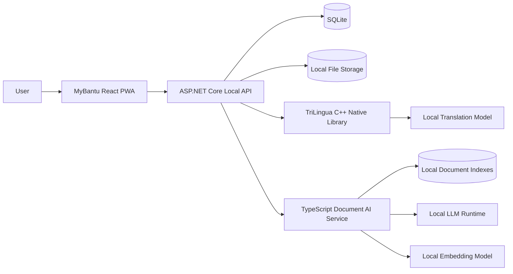
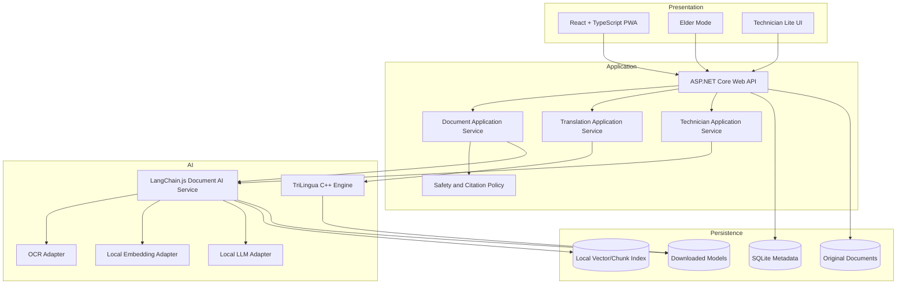
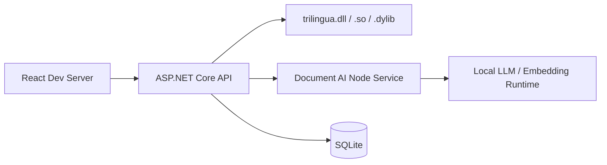
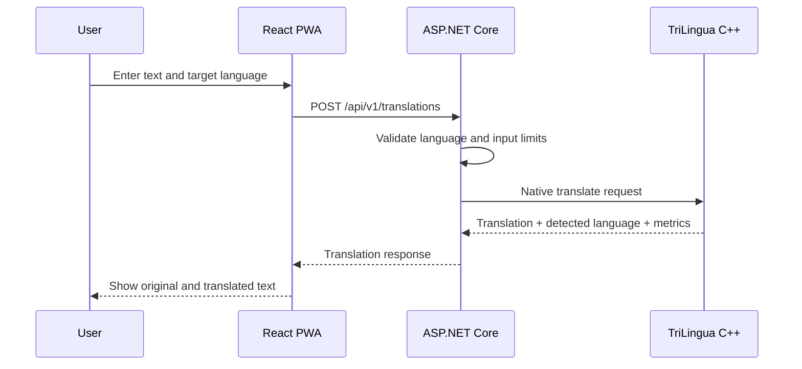
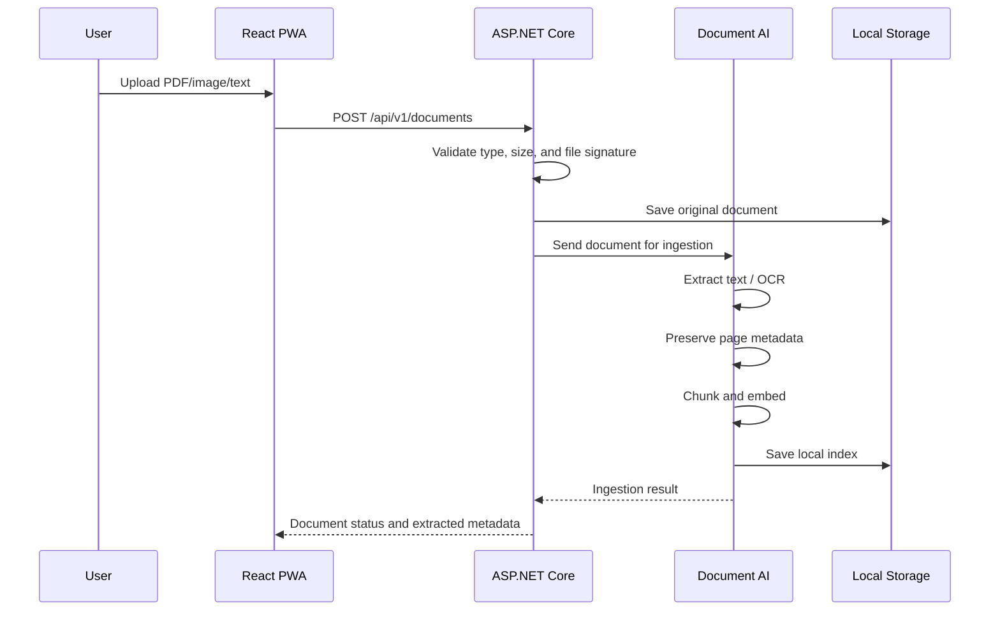
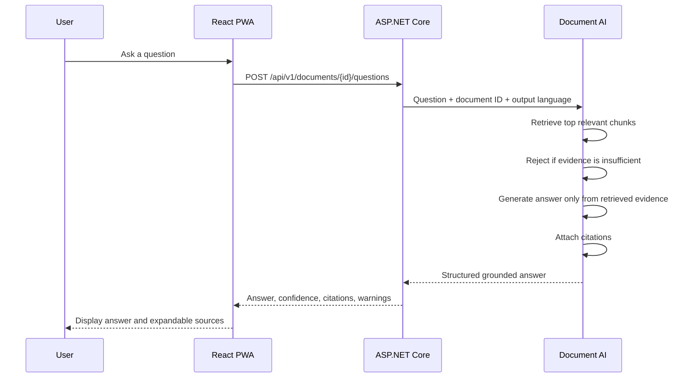
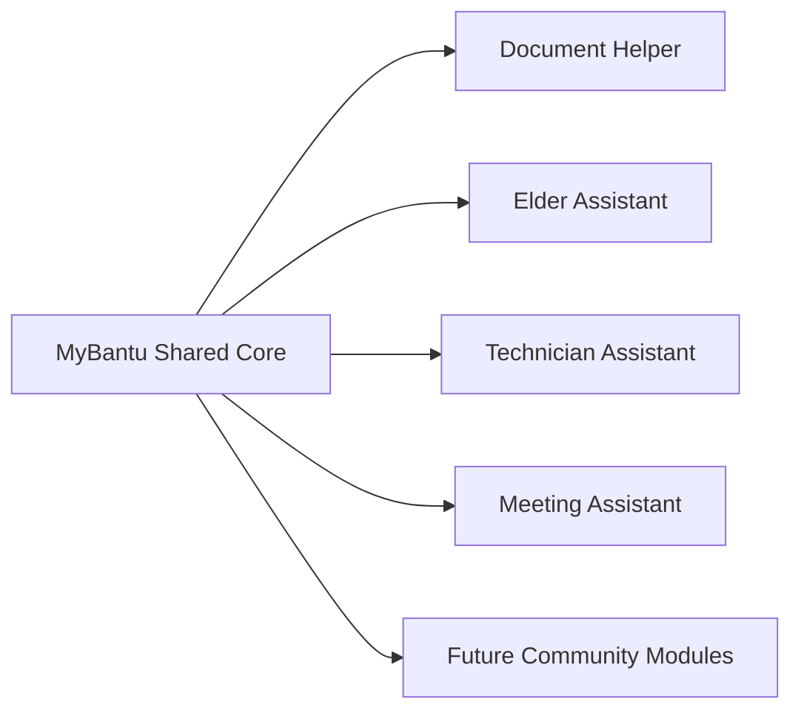

# MyBantu Architecture

## 1. Purpose

This document defines the target architecture for the MyBantu MVP and the extension path for later modules.

MyBantu is a local-first, trilingual AI platform supporting:

- English (`en`)
- Bahasa Melayu (`ms`)
- Chinese (`zh`)

The architecture intentionally separates:

1. user interface;
2. business/application logic;
3. document and RAG processing;
4. native translation inference;
5. local data and model storage.

This separation allows each sub-project to be demonstrated independently without duplicating the same AI logic.

---

## 2. Architecture goals

### Required

- Operate without an internet connection after models and dependencies are installed.
- Keep user documents local by default.
- Support all six translation directions between `en`, `ms`, and `zh`.
- Preserve page numbers and source text during document processing.
- Return citations with document answers.
- Allow AI components to be replaced through interfaces/adapters.
- Run as a single local product from the user's perspective.
- Provide clear error handling when a model or service is unavailable.

### Not required for MVP

- Distributed cloud deployment.
- Kubernetes.
- Multi-tenant SaaS.
- Autonomous agents.
- Model training.
- Live meeting transcription.
- Enterprise-scale vector search.
- Mobile-native applications.
- Automatic submission of government, legal, tax, tender, or payment forms.

---

## 3. System context



### Rule

The React frontend communicates only with the ASP.NET Core API.

It must not directly call:

- the C++ native library;
- the TypeScript RAG service;
- the local LLM runtime;
- the local embedding runtime.

ASP.NET Core is the application boundary and orchestration layer.

---

## 4. Logical component architecture



---

## 5. Technology allocation

| Concern               | Technology                                              | Responsibility                                                |
| --------------------- | ------------------------------------------------------- | ------------------------------------------------------------- |
| User interface        | React + TypeScript                                      | PWA, forms, accessibility, offline shell                      |
| Application API       | ASP.NET Core                                            | orchestration, validation, metadata, reports                  |
| Business storage      | SQLite + EF Core                                        | users/settings/documents/reports metadata                     |
| Document AI           | Node.js + TypeScript + LangChain.js                     | parsing, chunking, embeddings, retrieval, grounded generation |
| Translation inference | C++20 + ONNX Runtime                                    | local translation, language routing, batching, benchmark      |
| Local LLM             | Adapter to a local model runtime                        | summarisation and grounded answer generation                  |
| Embeddings            | Local embedding adapter                                 | multilingual semantic vectors                                 |
| OCR                   | Pluggable local OCR adapter                             | image and scanned-document text extraction                    |
| Packaging             | Local process launcher / Docker Compose for development | start required local services                                 |
| Testing               | xUnit, Vitest, React Testing Library, GoogleTest        | unit, integration, and contract tests                         |

### Framework rule

Use LangChain.js only inside the TypeScript Document AI service.

Do not introduce Semantic Kernel into the MVP unless a concrete C# feature requires it. ASP.NET Core can call the Document AI service through normal typed HTTP clients. This avoids two orchestration frameworks solving the same problem.

---

## 6. Repository structure

```text
mybantu/
├── README.md
├── ARCHITECTURE.md
├── MVP_SCOPE.md
├── AGENTS.md
├── CLAUDE.md
├── .env.example
├── docker-compose.dev.yml
│
├── apps/
│   └── web/
│       ├── src/
│       │   ├── app/
│       │   ├── features/
│       │   │   ├── translation/
│       │   │   ├── documents/
│       │   │   ├── elder-mode/
│       │   │   └── technician/
│       │   ├── components/
│       │   ├── api/
│       │   ├── offline/
│       │   └── accessibility/
│       └── tests/
│
├── services/
│   ├── api/
│   │   ├── src/
│   │   │   ├── MyBantu.Api/
│   │   │   ├── MyBantu.Application/
│   │   │   ├── MyBantu.Domain/
│   │   │   └── MyBantu.Infrastructure/
│   │   └── tests/
│   │       ├── MyBantu.UnitTests/
│   │       └── MyBantu.IntegrationTests/
│   │
│   └── document-ai/
│       ├── src/
│       │   ├── api/
│       │   ├── ingestion/
│       │   ├── ocr/
│       │   ├── chunking/
│       │   ├── embeddings/
│       │   ├── retrieval/
│       │   ├── generation/
│       │   ├── citations/
│       │   └── adapters/
│       └── tests/
│
├── native/
│   └── trilingua/
│       ├── include/
│       ├── src/
│       ├── tests/
│       ├── benchmarks/
│       └── CMakeLists.txt
│
├── packages/
│   ├── contracts/
│   └── shared-types/
│
├── data/
│   ├── app/
│   ├── documents/
│   ├── indexes/
│   └── samples/
│
├── models/
│   ├── translation/
│   ├── embeddings/
│   ├── llm/
│   └── ocr/
│
├── scripts/
│   ├── bootstrap/
│   ├── model-setup/
│   └── start-local/
│
└── docs/
    ├── adr/
    ├── api/
    ├── evaluation/
    └── privacy/
```

Generated databases, user documents, indexes, and model weights must be excluded from Git unless they are small, licensed test fixtures.

---

## 7. Runtime topology

### Development



### Packaged local application

A launcher starts:

1. the ASP.NET Core API;
2. the Document AI local service;
3. the configured local model runtime;
4. the PWA or desktop web shell.

The user sees one product. Internal processes are implementation details.

---

## 8. Core data flows

## 8.1 Text translation



### Translation response requirements

- original text;
- detected source language;
- requested target language;
- translated text;
- processing time;
- model version;
- warnings;
- optional glossary terms applied.

---

## 8.2 Document ingestion and indexing



### Each chunk must contain

```ts
type DocumentChunk = {
  chunkId: string;
  documentId: string;
  pageNumber: number | null;
  sectionTitle: string | null;
  text: string;
  startOffset: number | null;
  endOffset: number | null;
  language: "en" | "ms" | "zh" | "unknown";
};
```

Never discard page information when it exists.

---

## 8.3 RAG question answering



### Grounded answer contract

```ts
type GroundedAnswer = {
  answer: string;
  outputLanguage: "en" | "ms" | "zh";
  confidence: number; // 0.0 to 1.0, application estimate
  insufficientEvidence: boolean;
  warnings: string[];
  citations: Array<{
    documentId: string;
    pageNumber: number | null;
    chunkId: string;
    quote: string;
  }>;
};
```

### Mandatory refusal behavior

When retrieved evidence does not support an answer:

```json
{
  "answer": "I could not find enough information in this document to answer reliably.",
  "confidence": 0.2,
  "insufficientEvidence": true,
  "warnings": ["Check the original document or ask a qualified person."],
  "citations": []
}
```

The model must not answer from general memory when the user is asking about an uploaded document.

---

## 8.4 Elder Mode

Elder Mode is a presentation mode, not a separate backend.

It reuses the same document and translation APIs while changing:

- font size;
- contrast;
- touch target size;
- navigation complexity;
- reading level;
- output layout;
- amount/date/action emphasis;
- optional system text-to-speech.

The backend request includes:

```json
{
  "presentationMode": "elder",
  "readingLevel": "simple",
  "outputLanguage": "zh"
}
```

The backend must still return the normal structured result. The frontend decides how to present it.

---

## 8.5 Technician Lite

The MVP technician workflow supports:

1. upload a technical manual;
2. ask questions with citations;
3. record customer-reported issue;
4. record inspection result;
5. record action taken;
6. generate a trilingual basic service report.

It does not include full CRM, inventory, billing, route planning, or warranty automation.

---

## 9. Public API surface

Base path:

```text
/api/v1
```

### Health

```http
GET /health
```

### Translation

```http
POST /api/v1/translations
```

Request:

```json
{
  "text": "Sila bayar sebelum 18 Ogos.",
  "sourceLanguage": "auto",
  "targetLanguage": "zh",
  "glossaryId": null
}
```

### Documents

```http
POST   /api/v1/documents
GET    /api/v1/documents/{documentId}
DELETE /api/v1/documents/{documentId}
POST   /api/v1/documents/{documentId}/analyse
POST   /api/v1/documents/{documentId}/questions
```

### Technician reports

```http
POST /api/v1/service-reports
GET  /api/v1/service-reports/{reportId}
POST /api/v1/service-reports/{reportId}/translations
```

### Settings

```http
GET /api/v1/settings
PUT /api/v1/settings
```

---

## 10. Internal Document AI API

The Document AI service is private and available only to the ASP.NET Core API.

```http
POST /internal/v1/documents/ingest
POST /internal/v1/documents/{documentId}/analyse
POST /internal/v1/documents/{documentId}/answer
DELETE /internal/v1/documents/{documentId}/index
GET /internal/v1/health
```

The internal API must use shared JSON contracts and contract tests.

Do not expose the Document AI service directly to the browser.

---

## 11. C++ native boundary

Use a stable C ABI so .NET can call the native library through P/Invoke.

Illustrative interface:

```c
typedef struct {
    const char* text;
    const char* source_language;
    const char* target_language;
} mb_translation_request;

typedef struct {
    int status_code;
    char* translated_text;
    char* detected_language;
    double elapsed_ms;
    char* model_version;
    char* error_message;
} mb_translation_result;

int mb_initialize(const char* model_directory);
mb_translation_result mb_translate(const mb_translation_request* request);
void mb_free_translation_result(mb_translation_result* result);
void mb_shutdown(void);
const char* mb_get_version(void);
```

### Native safety requirements

- C++ owns and frees memory allocated by C++.
- Never allow exceptions to cross the C ABI boundary.
- Return explicit status codes.
- Validate null pointers and string encoding.
- Use UTF-8 across all boundaries.
- Protect shared inference sessions if requests can run concurrently.
- Include native unit tests and benchmark tests.
- Keep model-specific code behind an adapter.

---

## 12. Persistence model

### SQLite entities

```text
AppSetting
Document
DocumentAnalysis
TranslationHistory
ServiceReport
ServiceReportTranslation
ModelInstallation
```

### Document metadata

```text
Document
- Id
- OriginalFileName
- StoredFileName
- MimeType
- Sha256
- SizeBytes
- Status
- DetectedLanguage
- PageCount
- CreatedAtUtc
- IndexedAtUtc
- ErrorCode
- ErrorMessage
```

### Storage separation

- SQLite stores metadata and structured business records.
- Original documents are stored in `data/documents`.
- RAG indexes are stored in `data/indexes`.
- Models are stored in `models`.
- Temporary files are stored in an OS-specific temporary directory and deleted after use.

---

## 13. Security and privacy boundaries

### MVP controls

- Bind local services to loopback by default.
- Reject unsupported file extensions and mismatched file signatures.
- Set upload size and page-count limits.
- Sanitize displayed filenames.
- Generate stored filenames; never trust user-supplied paths.
- Calculate SHA-256 for duplicate detection and traceability.
- Do not execute uploaded content.
- Do not transmit documents to cloud services.
- Do not log full document content.
- Redact sensitive text from error logs.
- Provide a delete function that removes:
  - metadata;
  - original file;
  - extracted text;
  - vector index;
  - generated analysis.

### Prompt-injection rule

Uploaded documents are untrusted data.

Text inside a document must never be treated as developer instructions, system instructions, or executable tool commands.

The RAG prompt must clearly delimit retrieved content as evidence only.

---

## 14. Reliability rules

- Every service exposes a health endpoint.
- API responses use machine-readable error codes.
- Long-running ingestion uses status values:
  - `uploaded`;
  - `processing`;
  - `ready`;
  - `failed`.
- Failed processing must be retryable.
- Partial outputs must not be marked `ready`.
- A missing local model must produce a setup error, not a generic server error.
- The frontend must show whether the app is:
  - offline-ready;
  - missing a model;
  - processing;
  - unable to answer from evidence.

---

## 15. Observability

Local logs may contain:

- timestamp;
- correlation ID;
- operation name;
- duration;
- status;
- model version;
- chunk count;
- retrieval score summary.

Local logs must not contain:

- full uploaded documents;
- full user questions by default;
- full generated service reports;
- personal identifiers unless explicitly enabled for debugging.

---

## 16. Testing architecture

### C++

- language routing unit tests;
- UTF-8 boundary tests;
- invalid request tests;
- deterministic fixture translations where possible;
- memory ownership tests;
- benchmark tests.

### ASP.NET Core

- domain/application unit tests;
- API validation tests;
- SQLite integration tests;
- native adapter contract tests;
- Document AI typed-client tests;
- deletion and privacy tests.

### TypeScript Document AI

- parser tests;
- page metadata preservation tests;
- chunking tests;
- retrieval tests;
- citation construction tests;
- insufficient-evidence tests;
- prompt-injection resistance fixtures.

### React

- accessibility checks;
- translation form tests;
- upload-state tests;
- citation display tests;
- Elder Mode tests;
- offline-shell tests.

### End-to-end

At minimum:

1. translate one sentence for each language direction;
2. upload a sample text PDF;
3. extract page-aware text;
4. ask a supported question and receive a citation;
5. ask an unsupported question and receive an insufficient-evidence response;
6. delete the document and verify all local artifacts are removed;
7. create a basic technician service report.

---

## 17. Extension architecture

### Post-MVP modules



### Meeting and Classroom Assistant additions

- microphone capture;
- voice activity detection;
- streaming speech-to-text;
- subtitle buffering;
- speaker segmentation when feasible;
- live translation;
- transcript storage;
- summary and action-item extraction;
- SRT/TXT/PDF export.

These features must be added without changing the public translation and document contracts unnecessarily.

---

## 18. Architecture decisions

### ADR-001: One browser-facing API

The frontend calls only ASP.NET Core.

**Reason:** central validation, security, versioning, and orchestration.

### ADR-002: LangChain.js is limited to document AI

LangChain.js is not used throughout the whole codebase.

**Reason:** prevent framework coupling and keep normal business logic deterministic.

### ADR-003: Native translation uses a C ABI

ASP.NET Core calls the C++ engine through a small stable interface.

**Reason:** language interoperability and independent native benchmarking.

### ADR-004: SQLite and local files for MVP

No external database is required.

**Reason:** simple offline installation and sufficient MVP scale.

### ADR-005: Brute-force/local vector search is acceptable initially

The MVP corpus is intentionally small. The vector-store interface must remain replaceable.

**Reason:** avoid adding a production vector database before scale requires it.

### ADR-006: No autonomous agent in MVP

Use explicit pipelines and structured outputs.

**Reason:** predictable behavior is more important than autonomous planning for letters, bills, and technical manuals.

---

## 19. Definition of architectural success

The architecture is considered correctly implemented when:

- every module respects its boundary;
- the frontend has no direct native/model dependency;
- the application works locally after setup;
- documents remain on-device;
- page metadata survives ingestion;
- grounded answers include citations;
- unsupported questions are refused;
- translation and RAG providers can be replaced through adapters;
- the MVP can be demonstrated with no cloud API key.
